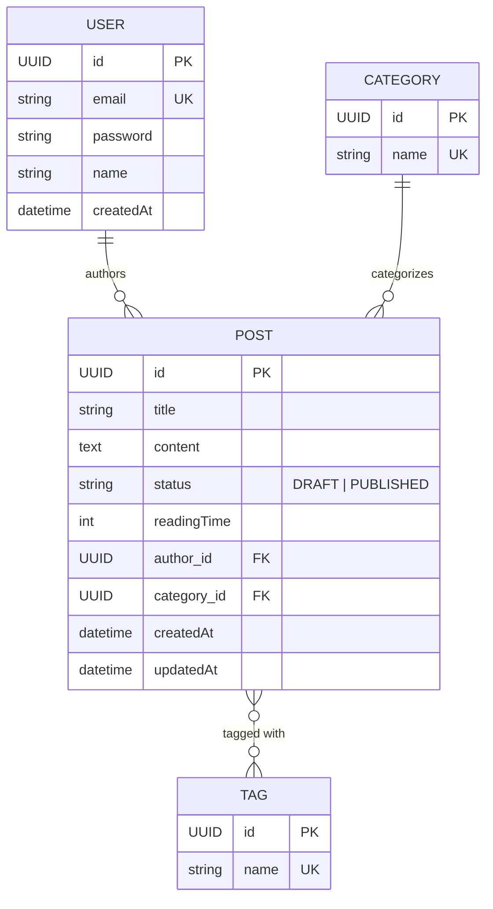

# Domain Model — Entity Relationship Diagram

This document describes the JPA entities in the blog backend and their relationships.

## Entities

- **User** — an author who can write posts.
- **Post** — a blog post, owned by a `User` (author) and assigned to a `Category`, with zero or more `Tag`s.
- **Category** — a single classification a post belongs to.
- **Tag** — a label that can be applied to many posts.

## Relationships

- `User` 1 — * `Post` (a user can author many posts; deleting a user cascades and deletes their posts)
- `Category` 1 — * `Post` (a category can have many posts; a post has exactly one category)
- `Post` * — * `Tag` (many-to-many via the `post_tags` join table)

## ERD

## Notes

- All primary keys are `UUID`s, generated via `GenerationType.UUID`.
- `Post.status` is a `PostStatus` enum (`DRAFT`, `PUBLISHED`), stored as a string.
- `User → Post` uses `CascadeType.ALL` with `orphanRemoval = true`: deleting a user deletes their posts.
- `Category → Post` and `Post → Tag` are not cascaded — categories and tags have independent lifecycles from posts.
- The `Post`–`Tag` many-to-many relationship is backed by a `post_tags` join table (`post_id`, `tag_id`).